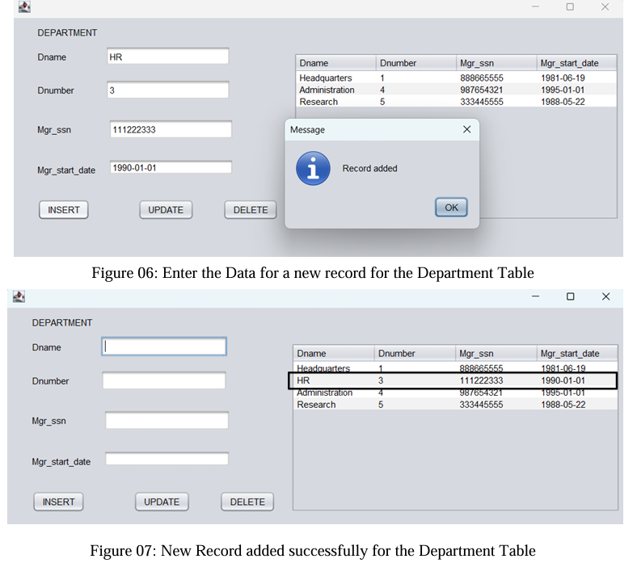

 ### 🚀 Java Database Management System
 
🔹 Implementing CRUD Operations in Java with MySQL

📌 About the Project

This project demonstrates how to manage a relational database using Java and MySQL. It covers:  
✅ Identifying correct SQL and Java data types 📊  
✅ Establishing a database connection using JDBC 🔗  
✅ Implementing CRUD operations (Create, Read, Update, Delete) 📝  
✅ Handling impedance mismatch between SQL and Java 🚧  
✅ Using prepared statements to prevent SQL injection 🔐

💡 Why This Project?
In real-world applications, data management is crucial. This project simulates an enterprise-level database management system, demonstrating efficient and secure database operations in Java. 
It also serves as a strong foundation for building backend applications in Java.

**⚙️ Tech Stack Used**   
Java (Core Programming) ☕  
MySQL (Database) 🛢️  
JDBC (Java Database Connectivity) 🔗  
NetBeans / IntelliJ IDEA (IDE) 🖥️  
MySQL Connector/J (JDBC Driver) 📡  
JCalendar (Optional, for date handling) 📅

